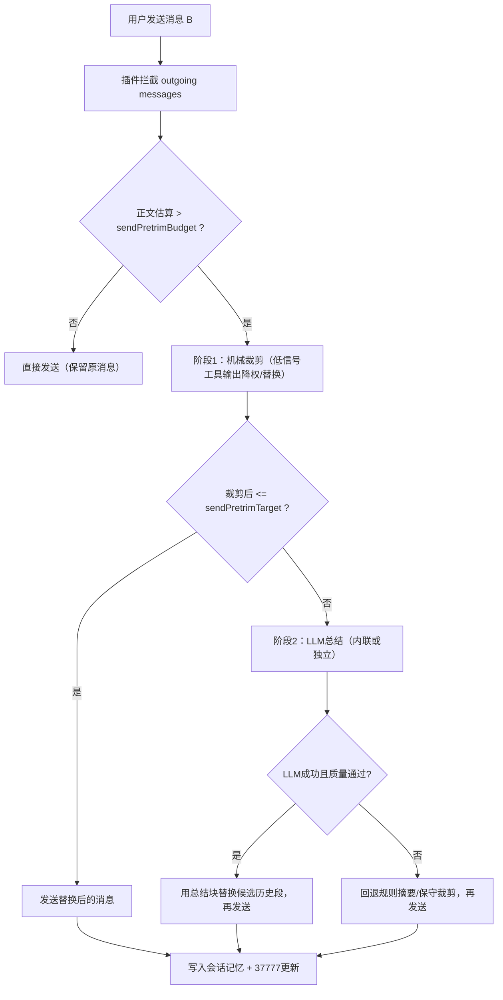
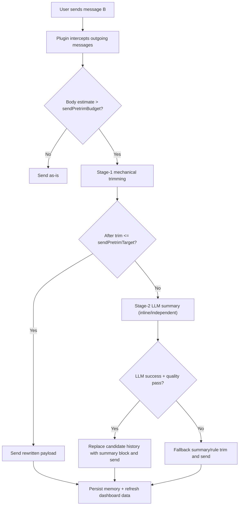

# OpenCode Memory System

## 中文教程（优先）

### 1. 这是什么
`opencode-memory-system` 是一个 OpenCode 插件，目标是同时解决两件事：
- 长期记忆：保存全局偏好、会话摘要、跨会话召回。
- token 控制：在发送前做机械裁剪与 LLM 总结，降低正文 token。

---

### 2. 安装

#### 2.1 必需文件
只需要两个插件文件：
- `plugins/memory-system.js`
- `plugins/scripts/opencode_memory_dashboard.mjs`

#### 2.2 放到 OpenCode 全局目录
macOS/Linux（默认）：
- `~/.config/opencode/plugins/memory-system.js`
- `~/.config/opencode/plugins/scripts/opencode_memory_dashboard.mjs`

Windows（推荐，与你的写法统一后的标准格式）：
- `C:\\Users\\<用户名>\\.config\\opencode\\plugins\\memory-system.js`
- `C:\\Users\\<用户名>\\.config\\opencode\\plugins\\scripts\\opencode_memory_dashboard.mjs`

Windows（等价环境变量写法）：
- `%USERPROFILE%\\.config\\opencode\\plugins\\memory-system.js`
- `%USERPROFILE%\\.config\\opencode\\plugins\\scripts\\opencode_memory_dashboard.mjs`

#### 2.3 在 `opencode.json` 启用插件
示例：
```json
{
  "plugin": [
    "./plugins/memory-system.js"
  ]
}
```

如果你使用插件组合，也可以写在同一个数组中。

#### 2.4 重启 OpenCode
重启后插件自动生效。

---

### 3. 使用方式

#### 3.1 自动运行（默认）
- 你正常聊天即可，无需每次手动命令。
- 插件会自动记录记忆、自动进行发送前裁剪。

#### 3.2 仪表盘（37777）
- 启动 OpenCode 后，仪表盘会跟随启动。
- 访问：`http://127.0.0.1:37777`
- 关闭 OpenCode 后，仪表盘会跟随关闭。

#### 3.3 你可以在仪表盘做什么
- 查看全局偏好与会话记忆。
- 编辑会话摘要。
- 批量删除会话记忆。
- 管理回收站（清理过期、永久删除）。
- 调整内存系统参数（保存后持久化，下次启动继续生效）。
- 在 `LLM设置` 页自动获取模型列表并验证独立LLM连通性。

---

### 4. 记忆与裁剪机制（简明版）

#### 4.0 运行流程图（发送前裁剪/总结/替换）


#### 4.1 记忆写入
- 用户消息、助手消息、工具结果会写入会话记忆文件。
- 全局偏好写入 `global.json`。

#### 4.2 注入
- 会话首条：可注入全局偏好。
- 固定频率：每 N 条用户消息注入当前会话摘要（默认 5）。
- 跨会话：命中跨会话意图时触发 recall 注入。

#### 4.3 发送前 token 控制
发送前按顺序执行：
1. 机械裁剪（低信号工具输出、噪音内容降权/替换）
2. 若仍超预算，再做 LLM 总结（内联或独立）
3. 失败自动回退，不阻断主对话
4. 若开启 `sendPretrimWarmupEnabled`，会在上一轮后后台预生成候选总结，减少下一轮发送等待

说明：
- 裁剪/LLM总结发生在“发送前”，所以可能带来本次发送前等待。
- 开启后台预总结后，下一轮更容易命中缓存（`warmup-cache`），体感更平滑。
- warmup 含保护机制：30 秒最小间隔、预算线触发、消息 ID 绑定校验（防串会话缓存）。

#### 4.4 六个场景（A/B/C/D/E/F 示例）
设：
- `A` = 历史正文上下文
- `B` = 你本轮新消息
- `C` = 机械裁剪后的历史
- `D` = LLM总结后的历史块
- `E` = 回退规则摘要
- `F` = 实际发送给模型的最终内容

场景 1：未超预算  
- 输入：`A + B`  
- 结果：不裁剪，`F = A + B`

场景 2：超预算，机械裁剪足够  
- 输入：`A + B`  
- 结果：机械裁剪得到 `C`，`F = C + B`

场景 3：超预算，机械裁剪不够，内联 LLM 总结成功  
- 输入：`A + B`  
- 结果：生成 `D` 替换候选历史段，`F = D + B`

场景 4：超预算，机械裁剪不够，独立 LLM 总结成功  
- 输入：`A + B`  
- 结果：生成 `D` 替换候选历史段，`F = D + B`

场景 5：超预算，LLM 总结失败，规则回退  
- 输入：`A + B`  
- 结果：用 `E` 代替候选历史段，`F = E + B`

场景 6：命中跨会话召回，再走发送前裁剪  
- 输入：`A + B`（B 含跨会话意图）  
- 结果：先注入 recall，再 pretrim，最终 `F` 可能为 `C + recall + B` 或 `D + recall + B`

补充：`E` 与 `C` 的区别  
- `C` 是“机械清噪后的原历史片段”，保留原句比例更高。  
- `E` 是“规则化回退摘要”，在 LLM 不可用或失败时用于兜底，信息密度更高但细节更粗。

---

### 5. 参数说明（核心）

以下参数都可在 37777 参数页配置并保存。

#### 5.1 开关参数
- `sendPretrimEnabled`：是否启用发送前裁剪。
- `sendPretrimWarmupEnabled`：是否启用后台预总结缓存（降低下一轮发送卡顿）。
- `dcpCompatMode`：DCP兼容模式（机械裁剪优先，超阈值再LLM总结）。
- `independentLlmEnabled`：是否启用独立LLM总结通路。
- `injectGlobalPrefsOnSessionStart`：新会话首条是否注入全局偏好。
- `recallEnabled`：是否允许跨会话召回。
- `visibleNoticesEnabled`：是否显示可见提示。

#### 5.2 数值参数
- `sendPretrimBudget`：发送前预算阈值（正文估算 token）。
- `sendPretrimTarget`：裁剪目标 token。
- `sendPretrimTurnProtection`：保护窗口（最近 N 条用户轮次不强裁剪，默认 10）。
- `currentSummaryEvery`：每多少条用户消息注入一次当前会话摘要（默认 5）。
- `currentSummaryTokenBudget`：单次当前会话摘要注入预算。
- `recallTokenBudget`：跨会话召回注入预算。
- `visibleNoticeCooldownMs`：可见提示冷却时间。

#### 5.3 LLM 总结模式
- `llmSummaryMode=auto`：默认模式；若独立LLM可用则优先独立，否则走内联。
- `llmSummaryMode=session`：强制内联总结。
- `llmSummaryMode=independent`：强制独立LLM总结（需配置完整连接信息）。

补充说明：
- 选择 `session`（内联）时，不需要填写独立LLM的 URL/Key/Model。
- 即使填写了独立LLM参数，只要模式是 `session`，也不会用于内联总结。
- 独立LLM配置仅在 `auto` 且独立通路可用，或 `independent` 模式下生效。

---

### 6. 数据路径

- 主目录：`~/.opencode/memory/`
- 全局偏好：`~/.opencode/memory/global.json`
- 会话记忆：`~/.opencode/memory/projects/<project>/sessions/*.json`
- 仪表盘数据：`~/.opencode/memory/dashboard/`
- 回收站：`~/.opencode/memory/trash/`
- 审计日志：`~/.opencode/memory/audit/memory-audit.jsonl`

---

### 7. 常见问题（简版）

#### 7.1 为什么没有跨会话记忆
- 检查 `recallEnabled` 是否开启。
- 检查是否命中跨会话意图（或手动 recall）。

#### 7.2 为什么 token 还是高
- 先确认 `sendPretrimEnabled=true`。
- 再确认 `sendPretrimBudget/Target` 设置是否过高。
- 系统层/MCP定义通常不由本插件裁剪。

#### 7.3 为什么 37777 没有更新
- 先刷新页面。
- 检查 OpenCode 是否已启动。
- 说明：`/api/dashboard` 是动态数据；`index.html` 是页面模板文件。
- 本插件现已支持“启动时自动从最新 `memory-system.js` 同步重建 `index.html`”，避免长期停留旧版页面。
- 如果你刚升级插件但页面还旧，重启 OpenCode（或重启 dashboard 服务）后会自动同步。

#### 7.4 如何看 warmup 是否生效
- 会话行会显示 `warmup:h/m/s/f` 与 `绑定ID`、`warmup状态`：
  - `h`=命中缓存次数（hit）
  - `m`=缓存未命中次数（miss）
  - `s`=跳过次数（预算不足/间隔冷却）
  - `f`=失败次数（fail）
- 展开会话可查看 `warmup日志`（最近事件）。
- `/memory doctor current` 可查看 warmup 详细字段（包括绑定 ID 与命中/未命中统计）。

---

## English Guide

### 1. What this plugin does
`opencode-memory-system` combines:
- Long-term memory (global preferences, session summaries, cross-session recall)
- Token control (send-time trimming + LLM summarization)

### 2. Installation

Required files:
- `plugins/memory-system.js`
- `plugins/scripts/opencode_memory_dashboard.mjs`

Default global plugin paths:
- macOS/Linux: `~/.config/opencode/plugins/...`
- Windows: `C:\\Users\\<username>\\.config\\opencode\\plugins\\...` (or `%USERPROFILE%\\.config\\opencode\\plugins\\...`)

Enable plugin in `opencode.json`:
```json
{
  "plugin": [
    "./plugins/memory-system.js"
  ]
}
```

Restart OpenCode.

### 3. Usage
- Works automatically in normal chats.
- Dashboard: `http://127.0.0.1:37777`
- Dashboard follows OpenCode lifecycle (start/stop).
- In the `LLM Settings` tab, you can auto-fetch model list and validate independent LLM connectivity.

### 4. Runtime flow (short)
1. Record events (user/assistant/tool)
2. Inject memory (global/session/recall, based on rules)
3. Pre-send trim (mechanical first)
4. If still over budget, run LLM summarization
5. Fallback automatically if summarization fails
6. Optional background warmup prepares next-turn summary cache (`warmup-cache`)

Flow:


Note:
- Trimming/LLM summary runs before sending, so that turn may wait briefly.
- Warmup can reduce the next-send latency.
- Warmup guards: 30s minimum interval, budget-triggered start, and user-message-id binding to avoid cross-window cache mismatch.

### 5. Key parameters

Toggles:
- `sendPretrimEnabled`
- `sendPretrimWarmupEnabled`
- `dcpCompatMode`
- `independentLlmEnabled`
- `injectGlobalPrefsOnSessionStart`
- `recallEnabled`
- `visibleNoticesEnabled`

Numeric:
- `sendPretrimBudget`
- `sendPretrimTarget`
- `sendPretrimTurnProtection` (default 10)
- `currentSummaryEvery` (default 5)
- `currentSummaryTokenBudget`
- `recallTokenBudget`
- `visibleNoticeCooldownMs`

LLM summary mode:
- `auto`
- `session`
- `independent`

Notes:
- In `session` mode, independent URL/Key/Model are not required.
- Independent config is used only in `auto` (when available) or `independent` mode.

### 6. Data locations
- `~/.opencode/memory/`
- `~/.opencode/memory/global.json`
- `~/.opencode/memory/projects/<project>/sessions/*.json`
- `~/.opencode/memory/dashboard/`
- `~/.opencode/memory/trash/`
- `~/.opencode/memory/audit/memory-audit.jsonl`

### 7. Warmup observability
- Session row shows `warmup:h/m/s/f` plus binding/status:
  - `h`=cache hit count
  - `m`=cache miss count
  - `s`=skipped count (budget/cooldown)
  - `f`=failure count
- Expand a session to view `warmup logs` (recent entries).
- Use `/memory doctor current` for detailed warmup state.
