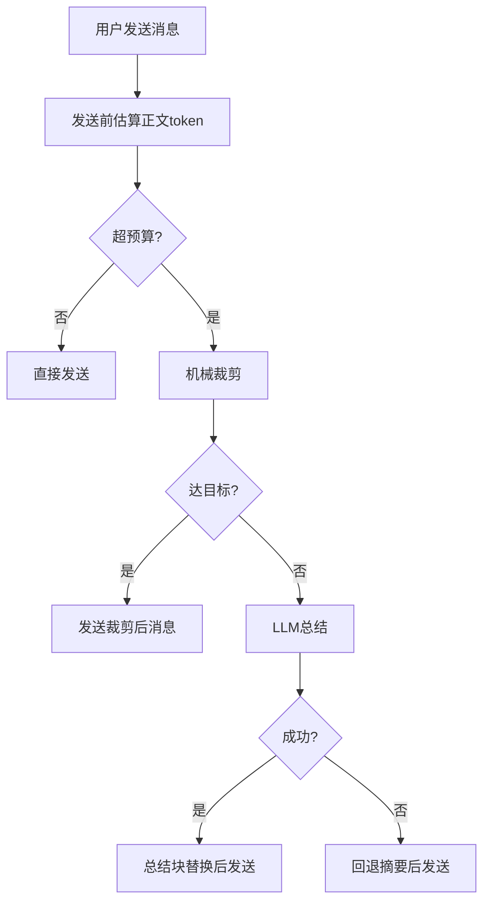
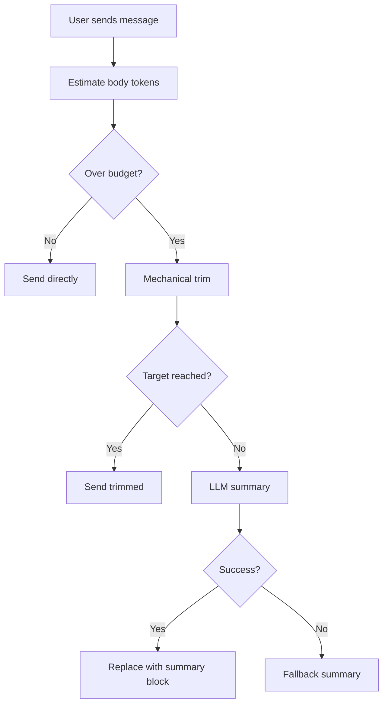

# OpenCode Memory System

一个把 **Claude-Mem 风格记忆** 和 **DCP 风格发送前裁剪/总结** 合并的 OpenCode 插件。

## 目录
- [中文说明](#中文说明)
- [English Guide](#english-guide)

---

## 中文说明

### 目录（中文）
- [1. 功能概览](#1-功能概览)
- [2. 安装教程](#2-安装教程)
- [3. 启动与使用](#3-启动与使用)
- [4. 37776 页面说明](#4-37776-页面说明)
- [5. 参数说明](#5-参数说明)
- [6. 模板机制](#6-模板机制)
- [7. 裁剪/总结/替换流程](#7-裁剪总结替换流程)
- [8. 数据文件路径](#8-数据文件路径)
- [9. memory 工具命令](#9-memory-工具命令)
- [10. 常见问题](#10-常见问题)
- [11. 测试与验证](#11-测试与验证)
- [12. 更新日志](#12-更新日志)

### 1. 功能概览
- **自动会话记忆**（项目维度 + 会话维度）。
- **全局偏好记忆**（`global.json`），仅保存语言、昵称、风格等持久偏好。
- **项目级路径锚点**（`pathAnchors`），按项目隔离存储，多项目不互相污染。
- **跨会话召回**（触发词或手动 recall）。
- **发送前机械裁剪**（低信号工具输出降权/替换）。
- **超阈值后 LLM 总结**（内联或独立模式）。
- **会话压缩摘要**（保留完整最早历史，不丢失起始对话）。
- **37776 看板可视化管理**（参数、模板、LLM、回收站、实时刷新）。

### 2. 安装教程

#### 2.0 一键安装（macOS / Linux）

```bash
git clone https://github.com/wsxwj123/opencode-memory-system.git
cd opencode-memory-system
mkdir -p ~/.config/opencode/plugins/scripts ~/.config/opencode/plugins/dashboard
cp plugins/memory-system.js ~/.config/opencode/plugins/
cp plugins/scripts/opencode_memory_dashboard.mjs ~/.config/opencode/plugins/scripts/
cp plugins/dashboard/template.html ~/.config/opencode/plugins/dashboard/
```

#### 2.0.1 一键安装（Windows PowerShell）

```powershell
git clone https://github.com/wsxwj123/opencode-memory-system.git
cd opencode-memory-system
$dest = "$env:USERPROFILE\.config\opencode\plugins"
New-Item -ItemType Directory -Force -Path "$dest\scripts", "$dest\dashboard" | Out-Null
Copy-Item plugins\memory-system.js "$dest\"
Copy-Item plugins\scripts\opencode_memory_dashboard.mjs "$dest\scripts\"
Copy-Item plugins\dashboard\template.html "$dest\dashboard\"
```

#### 2.0.2 一键安装（Windows CMD）

```cmd
git clone https://github.com/wsxwj123/opencode-memory-system.git
cd opencode-memory-system
mkdir "%USERPROFILE%\.config\opencode\plugins\scripts"
mkdir "%USERPROFILE%\.config\opencode\plugins\dashboard"
copy plugins\memory-system.js "%USERPROFILE%\.config\opencode\plugins\"
copy plugins\scripts\opencode_memory_dashboard.mjs "%USERPROFILE%\.config\opencode\plugins\scripts\"
copy plugins\dashboard\template.html "%USERPROFILE%\.config\opencode\plugins\dashboard\"
```

> 如果你只是想安装插件，不需要把整个仓库都塞进 OpenCode 配置目录。真正必须复制进去的，只有上面这 3 个文件。

#### 2.1 需要的三个文件
| 源文件 | macOS/Linux 目标 | Windows 目标 |
|--------|------------------|--------------|
| `plugins/memory-system.js` | `~/.config/opencode/plugins/memory-system.js` | `%USERPROFILE%\.config\opencode\plugins\memory-system.js` |
| `plugins/scripts/opencode_memory_dashboard.mjs` | `~/.config/opencode/plugins/scripts/opencode_memory_dashboard.mjs` | `%USERPROFILE%\.config\opencode\plugins\scripts\opencode_memory_dashboard.mjs` |
| `plugins/dashboard/template.html` | `~/.config/opencode/plugins/dashboard/template.html` | `%USERPROFILE%\.config\opencode\plugins\dashboard\template.html` |

#### 2.3 opencode.json 启用
不要直接用 README 里的示例去覆盖你原来的 `~/.config/opencode/opencode.json`。
正确做法是：
- 打开你自己现有的 `opencode.json`
- 找到里面的 `"plugin"` 数组
- 只往数组里增加一行：
  - `"./plugins/memory-system.js"`
- 保留你原来已有的其他插件、模型、MCP、权限配置，不要改乱原有结构

例如你原来可能是：

```json
{
  "model": "xxx",
  "plugin": [
    "./plugins/oh-my-opencode-slim.js",
    "./plugins/superpowers.js"
  ]
}
```

安装后应该改成：

```json
{
  "model": "xxx",
  "plugin": [
    "./plugins/memory-system.js",
    "./plugins/oh-my-opencode-slim.js",
    "./plugins/superpowers.js"
  ]
}
```

如果你原来没有 `"plugin"` 这一段，再补上即可。

下面这个最小示例只是演示格式，不代表你应该拿去整段覆盖自己的配置：

```json
{
  "plugin": [
    "./plugins/memory-system.js"
  ]
}
```

#### 2.4 重启 OpenCode
重启后自动生效。`37776` 当前实现是 watchdog 跟随模式，通常会随 OpenCode 启动；如果本地未拉起，可手动执行 restart/start 恢复。

#### 2.5 安装后如何确认装对了
- 终端执行 `opencode web`
- 打开：
  - `http://127.0.0.1:4096`
  - `http://127.0.0.1:37776`
- 如果 `37776` 能打开，并且会话页里能看到记忆统计、参数页、LLM设置、回收站，就说明插件已经被加载
- 顶部还会显示一个连接状态小标记

### 3. 启动与使用
- 正常聊天即可，默认自动记录记忆与发送前裁剪。
- 看板地址：`http://127.0.0.1:37776`
- 支持 OpenCode 前端与 CLI。
- 常见使用方式：
  1. **直接聊天**：插件会自动记住当前会话摘要，并在需要时做发送前裁剪。
  2. **跨会话续接**：在新会话里明确提到"另一个会话/上一个会话/刚刚那个会话"，会触发 recall 注入。
  3. **写入全局偏好**：直接说"请记住我偏好中文回复"这类句子，模型可调用 memory 写入全局偏好。
  4. **路径锚点**：说"记住路径锚点 /path/to/project"，会**自动存入当前项目的记忆**，不会污染其他项目。
  5. **调参数**：去 37776 的"参数页"或"LLM设置"页保存，下一次请求**立即生效**（无缓存，每次从磁盘读取）。
  6. **手动命令**：`/memory recall`, `/memory stats`, `/memory doctor`, `/memory anchors` 等。

### 4. 37776 页面说明
菜单顺序：
1. 会话记忆
2. 摘要模板设置
3. LLM设置
4. 参数设置
5. 回收站

#### 4.1 会话记忆页
- 查看各会话统计、注入次数、pretrim 轨迹。
- 编辑摘要、删除会话记忆、批量删除。
- 左上角会显示面板连接状态，帮助判断 37776 是否还连着后台服务。
- 支持 `全选 / 全不选 / 批量删除`。
- 展开某个会话后，可以直接看到：
  - `压缩摘要`（保留完整历史，不截断起始对话）
  - `发送前系统层审计`
  - `发送前裁剪轨迹`
  - `后台预总结日志`
- 每个会话显示总事件数，展开时最多显示 80 条最新事件，摘要块最多 10 条。

#### 4.2 摘要模板设置页
- 支持占位符模板（JSON/Markdown 都可）。
- 支持模板命名、按名称保存、选择并设为当前模板。
- 支持模板预览与恢复默认。

#### 4.3 LLM 设置页
- 自动拉取模型列表。
- 验证配置（成功/失败均有明确提示）。
- 支持内联模式、独立模式、自动模式。
- 协议支持：`openai_compatible`、`gemini`、`anthropic`。

#### 4.4 参数设置页
- 双栏折叠布局：
  - 左：开关参数（默认展开）
  - 右：数值参数（默认折叠）
- 修改后保存即持久化，**立即生效**。

#### 4.5 回收站页
- 支持保留天数、清理过期、永久删除。

### 5. 参数说明
核心参数：
- `sendPretrimEnabled`: 发送前裁剪开关。
- `sendPretrimBudget`: 触发预算阈值。
- `sendPretrimTarget`: 裁剪目标阈值。
- `sendPretrimTurnProtection`: 最近保护窗口轮数。
- `sendPretrimDistillTriggerRatio`: LLM总结触发比例。
- `llmSummaryMode`: `auto|session|independent`。
- `independentLlm*`: 独立LLM连接参数。
- `visibleNoticesEnabled`: 总开关，控制是否发可见提示。
- `visibleNoticeForDiscard`: 是否显示"已裁剪/已丢弃"类提示。
- `visibleNoticeCurrentSummaryMirrorEnabled`: current-summary 注入时是否启用镜像提示策略。
- `visibleNoticeCooldownMs`: 可见提示冷却，避免刷屏。

### 6. 模板机制

#### 6.1 占位变量
`{{window}} {{events}} {{status}} {{sessionCwd}} {{recommendedWorkdir}} {{relatedWorkdirs}} {{keyFacts}} {{taskGoal}} {{keyOutcomes}} {{toolsUsed}} {{skillsUsed}} {{keyFiles}} {{decisions}} {{blockers}} {{todoRisks}} {{nextActions}} {{workdirScoring}} {{handoffAnchor}}`

#### 6.2 JSON 模板示例
```json
{
  "status": "{{status}}",
  "workspace": "{{recommendedWorkdir}}",
  "key_outcomes": "{{keyOutcomes}}",
  "next_actions": "{{nextActions}}"
}
```

#### 6.3 模板保存位置
- 模板以字符串字典形式保存在 `~/.opencode/memory/config.json`
- 相关字段：
  - `memorySystem.summaryTemplates`
  - `memorySystem.activeSummaryTemplateName`

### 7. 裁剪/总结/替换流程


#### 7.1 模板外置与回退
- 仪表盘页面模板已外置到 `plugins/dashboard/template.html`。
- `memory-system.js` 渲染时优先读取该模板并注入数据。
- 若模板缺失/损坏，自动回退到内嵌 legacy 渲染，不影响功能。

### 8. 数据文件路径
```
~/.opencode/memory/
├── global.json                           # 全局偏好（语言、昵称、风格）
├── config.json                           # 运行时参数、模板、LLM配置
├── audit/memory-audit.jsonl              # 审计日志
├── dashboard/index.html                  # 生成的看板页面
├── trash/                                # 回收站
└── projects/
    └── <project-name>/
        ├── memory.json                   # 项目元数据 + 路径锚点 (pathAnchors)
        └── sessions/
            └── <session-id>.json         # 会话记忆文件
```

### 9. memory 工具命令

| 子命令 | 用法 | 说明 |
|--------|------|------|
| global | `/memory global <key>` | 读取全局偏好，例如 `preferences.language`、`preferences.note` |
| anchors | `/memory anchors [add\|delete <value>]` | 查看/添加/删除当前项目的路径锚点（按项目隔离） |
| set | `/memory set <key> <value>` | 直接写入全局键值 |
| prefer | `/memory prefer <key> <value>` | 写入 `preferences.<key>` |
| recall | `/memory recall <query>` | 从历史 session 召回相关记忆 |
| stats | `/memory stats [session <id>]` | 查看当前项目或指定 session 的统计与审计状态 |
| doctor | `/memory doctor [session <id>]` | 查看当前记忆、注入、pretrim、风险状态 |
| context | `/memory context [session <id>]` | 查看当前或指定 session 的记忆上下文 |
| compact | `/memory compact [session <id>]` | 对会话执行压缩+紧凑+低值裁剪 |
| compress | `/memory compress <topic> <summary...>` | 写入压缩摘要块 |
| discard | `/memory discard [session <id>\|current] [aggressive]` | 手动裁剪旧低信号工具输出 |
| extract | `/memory extract [session <id>\|current] [maxEvents]` | 抽取关键历史到结构化摘要 |
| prune | `/memory prune [session <id>]` | 对当前或指定 session 执行裁剪组合动作 |
| distill | `/memory distill <id:distillation> ...` | 写入人工蒸馏摘要 |
| clear | `/memory clear [session <id>\|sessions <id1,id2,...>\|project\|all]` | 清理指定范围的记忆数据 |
| dashboard | `/memory dashboard` | 启动/重启 37776 看板 |
| sessions | `/memory sessions` | 列出当前项目的所有会话 |

### 10. 常见问题
- **Q: 路径锚点会污染其他项目吗？**
  - A: 不会。路径锚点现在按项目隔离存储在 `projects/<project>/memory.json` 的 `pathAnchors` 数组中。全局偏好 `preferences.note` 只保存非路径内容。新会话启动时，只会注入**当前项目**的路径锚点。
- **Q: 37776 页面修改参数后会立即生效吗？**
  - A: 会。插件每次都从磁盘读取 `~/.opencode/memory/config.json`，没有内存缓存。Dashboard 保存参数后，下一次请求即使用新值。
- **Q: 压缩摘要为什么只有最后几轮？**
  - A: 已修复。现在使用 `truncateText`（保留开头=最早历史）替代了旧的 `truncateFromEnd`（保留末尾），并增大了摘要字符限制到 8000 和保留事件数到 36。
- **Q: `doctor` 怎么用？**
  - A: `/memory doctor` 或 `/memory doctor session <id>`。先看它报的是哪一类问题（未触发、裁剪太激进、system太高、LLM失败），然后去 37776 调对应参数。
- **Q: 可见通知（记忆提示）会导致 AI 回复消失吗？**
  - A: 已修复。所有 `emitVisibleNotice` 都使用 `noReply: true`，不会覆盖 AI 回复。
- **Q: compact 工具和 `/memory compact` 冲突吗？**
  - A: 不会。已将独立的 compact 工具合并为 `/memory compact` 子命令，避免工具注册冲突。
- **Q: 页面没更新？**
  - A: 强刷浏览器，或重启 OpenCode。
- **Q: 独立LLM超时？**
  - A: 默认已是 `30000ms`，可在 37776 的 `LLM设置`页继续调高。
- **Q: 37776 没起来？**
  - A: 手动执行：
    - `node ~/.config/opencode/plugins/scripts/opencode_memory_dashboard.mjs restart 37776`

### 11. 测试与验证

当前回归测试基线：

| 测试套件 | 测试数 | 状态 |
|----------|--------|------|
| `run_path_regression_suite.mjs` | 111/111 | PASS |
| `memory_subcommand_matrix_suite.mjs` | 20/20 | PASS |
| `mcp_skill_notice_switch_suite.mjs` | 7/7 | PASS |
| `protection_provider_acceptance_suite.mjs` | 7/7 | PASS |
| `dashboard_interaction_acceptance_suite.mjs` | 12/12 | PASS |
| `notice_archive_closure_suite.mjs` | 2/2 | PASS |

运行主测试套件：
```bash
node scripts/run_path_regression_suite.mjs
```

### 12. 更新日志

#### 2026-05-04 (v2.1.0)
**Apple 风格 Dashboard 重制 + 摘要质量大修 + 并发安全 + 跨 cwd 共享记忆**

UI / Dashboard：
- 完全重写 `buildDashboardHtmlLegacy`：Apple 官网风格（系统字体、毛玻璃 header、48px hero、药丸按钮、Apple Switch）
- **中英文双语 i18n**（顶部 中/EN 切换，~70 条文案）
- 所有面板**默认折叠**（原生 `<details>`），点 ▸ 才展开
- **Section 内容懒加载**：第一次点 ▸ 才填 DOM，解决多 KB 摘要的卡顿
- session 条目精简：去掉聊天记录显示，只保留 编辑/重置/删除按钮 + 5 个折叠 section（压缩摘要/压缩块/裁剪轨迹/系统审计/预热缓存）
- **批量操作**：☐ 全选 / 取消所选 / 批量删除（计数显示）
- **编辑摘要 modal 懒加载**（`requestAnimationFrame` 延迟塞入大 textarea）
- **新增"重置摘要"按钮**：清掉历史脏 `compressedText`，下次裁剪自动按新格式生成
- 移除 5s 自动轮询 → 手动刷新（性能提升明显）
- Dashboard 写盘 debounce（1.5s 合并），原本每事件一次写

摘要质量：
- `buildCompressedChunk` 重写输出：`## Session Summary` + Goal/Key facts/Key files/Decisions/Blockers/Open items/Next，移除 workdir scoring、related_workdirs、tools used、handoff anchor 等调试字段
- 过滤源头噪音：`[toolname] input={...}` 工具 I/O JSON、sub-agent CoT (`**Thinking...** I need to...`)、`output compacted by adaptive policy` 占位符
- `appendCompressedSummaryChunk` / `enforceSessionFileBudget`：**REPLACE 替换**而不是 MERGE 合并；不再丢前面的内容；历史块全部保留在 `summaryBlocks`
- LLM distill prompt 重写硬规则要求干净格式输出
- `extractDistillTextFromResponse` 加多字段兜底：`reasoning_content` / `output_text` / `output[].content[].text` —— 解决 gpt-5.4 等推理模型的 `empty_text`
- `distill-empty-debug.log` 自动 rotate（>1MB 切到 .1）
- 中文 nickname 抽取：`我叫X` / `叫我X` / `我的名字是X` 配合"记住"自动写 `preferences.nickname`
- 机械 fallback 修字段映射：tool-result 不再被错分到 assistant
- 摘要块 dedup：相同窗口的 block 不再连续刷写

并发与稳定：
- 新增 `mutateSessionMemoryAsync` helper + **`AsyncLocalStorage` 可重入锁**（修死锁：processUserMessageEvent 锁住后内部 await injectMemoryText 又取同 session 锁）
- 3 个 async mutator 加锁：`schedulePretrimWarmupFromMessages` / `injectMemoryText` / `maybeInjectTriggerRecall`
- `cleanupSessionRuntimeState` 补漏：`sessionProjectCache` / `sessionProjectLookupLastAt` / `sessionNoticeState` 不再泄漏
- 修 select-all 闭包 stale bug（切换项目后 SELECTED_SESSIONS 不再污染）

注入与召回（去打扰）：
- 注入提示**默认全关**：`visibleNoticesEnabled` / `visibleNoticeCurrentSummaryMirrorEnabled` / `visibleNoticeForDiscard` 默认 `false`，`notificationMode='off'`
- 召回关键词收紧：去掉 "那个会话/上次那个对话" 等过宽短语
- `referencesAnotherSessionTitle` 单向匹配，title 长度阈 8（短标题不再误中）
- `injectGlobalReadResultHint` 同 turn dedup
- 周期摘要：`count % every === 0` modulo gate → `lastPeriodicSummaryUserCount` 增量跟踪
- 会话恢复触发间隔 5 分钟 → 60 分钟（不再每次回来都"已恢复"打断）

输入处理与 Bug 修：
- `inferGlobalPreferenceWriteFromText` 早退修复：`/记住(.+)/` 命中但 m[1] 推断不出 key 时让全文 fallback 有机会
- `getIntPreference` / `getFloatSetting` clamp fallback
- 文本指纹 dedup 加 4 秒时间窗（合法 retry 不再被 silent drop）

跨 cwd 项目识别：
- `getProjectName()` 优先 honor opencode DB 的 `project_id`：DB 返回 `'global'` 时 plugin 用 `global/` 目录（让所有非 git 仓库的 cwd 共享记忆）
- 支持 git 仓库：cwd 在 git 仓库内时 plugin 自动按 git root basename 分组
- 配套迁移：把零散的 cwd-basename 项目目录合并到 `global/`

Dashboard 服务（`scripts/opencode_memory_dashboard.mjs`）：
- 禁用 `syncDashboardHtmlFromPlugin`：之前的源码提取 + vm 重渲在模板字面量场景 brace 计数失败，**plugin 自身的 `writeDashboardFiles` 是唯一写源**

#### 2026-04-03 (v2.0.0)
**路径锚点项目隔离 + 7项实战修复**

新功能：
- 路径锚点按项目存储到 `projects/<project>/memory.json` 的 `pathAnchors` 数组
- 新会话启动时注入 `<OPENCODE_PROJECT_PATH_ANCHORS>` 块（仅当前项目）
- 新增 `/memory anchors [add|delete <value>]` 子命令
- `appendValueToGlobalNote` 自动检测路径内容并重定向到项目记忆
- `buildGlobalPrefsContextText` 过滤全局 note 中的旧路径条目，避免重复注入
- 路径锚点查询（"我的路径锚点是什么"）从项目记忆读取

修复：
- **(Q6 CRITICAL)** `emitVisibleNotice` 的 `noReply` 从 `false` 改为 `true`，解决可见通知导致 AI 回复消失的问题
- **(Q3)** 全局记忆写入白名单 `isAllowedGlobalPreferenceKey`，项目代号/任务数据不再写入全局
- **(Q5)** 移除独立 compact 工具，合并为 `/memory compact` 子命令，避免工具注册冲突
- **(Q7)** Dashboard 事件显示上限从 30 提升到 80，摘要块从 5 提升到 10，新增 `totalEventsCount`
- **(Q4)** `extractSessionTitle` 扩展了更多标题字段路径
- **压缩摘要修复**：`truncateFromEnd` 改为 `truncateText`（保留最早历史），字符限制从 2400 提升到 8000，保留事件数从 18 提升到 36
- 系统指令明确禁止将项目代号、任务数据写入全局记忆

#### 2026-03-11
- 完善 DCP 兼容性，发送前裁剪全链路验证
- 37776 看板连接状态标记
- 系统层审计卡片默认折叠
- 多轮回归测试扩展到 100+ 场景

---

## English Guide

### Contents
- [What It Does](#what-it-does)
- [Install](#install)
- [Usage](#usage)
- [Dashboard Pages](#dashboard-pages)
- [Memory Commands](#memory-commands)
- [Path Anchors](#path-anchors)
- [Pretrim Flow](#pretrim-flow)
- [Paths](#paths)
- [FAQ](#faq)

### What It Does
- **Session/global memory**: automatic per-session recording with project-level organization.
- **Project-scoped path anchors**: file/directory paths stored per-project, never leaked across projects.
- **Cross-session recall**: mention a previous session to retrieve relevant context.
- **Send-time mechanical trim**: low-signal tool outputs are pruned before sending.
- **LLM summary on overflow**: inline or independent LLM summarization when token budget is exceeded.
- **Session compression**: preserves earliest conversation history, not just recent turns.
- **Visual dashboard at `:37776`**: real-time management of settings, templates, LLM config, and trash.

### Install

#### Quick Install (macOS / Linux)
```bash
git clone https://github.com/wsxwj123/opencode-memory-system.git
cd opencode-memory-system
mkdir -p ~/.config/opencode/plugins/scripts ~/.config/opencode/plugins/dashboard
cp plugins/memory-system.js ~/.config/opencode/plugins/
cp plugins/scripts/opencode_memory_dashboard.mjs ~/.config/opencode/plugins/scripts/
cp plugins/dashboard/template.html ~/.config/opencode/plugins/dashboard/
```

#### Quick Install (Windows PowerShell)
```powershell
git clone https://github.com/wsxwj123/opencode-memory-system.git
cd opencode-memory-system
$dest = "$env:USERPROFILE\.config\opencode\plugins"
New-Item -ItemType Directory -Force -Path "$dest\scripts", "$dest\dashboard" | Out-Null
Copy-Item plugins\memory-system.js "$dest\"
Copy-Item plugins\scripts\opencode_memory_dashboard.mjs "$dest\scripts\"
Copy-Item plugins\dashboard\template.html "$dest\dashboard\"
```

#### Quick Install (Windows CMD)
```cmd
git clone https://github.com/wsxwj123/opencode-memory-system.git
cd opencode-memory-system
mkdir "%USERPROFILE%\.config\opencode\plugins\scripts"
mkdir "%USERPROFILE%\.config\opencode\plugins\dashboard"
copy plugins\memory-system.js "%USERPROFILE%\.config\opencode\plugins\"
copy plugins\scripts\opencode_memory_dashboard.mjs "%USERPROFILE%\.config\opencode\plugins\scripts\"
copy plugins\dashboard\template.html "%USERPROFILE%\.config\opencode\plugins\dashboard\"
```

#### Enable plugin in `opencode.json`
Add `"./plugins/memory-system.js"` to the `"plugin"` array:
```json
{
  "plugin": ["./plugins/memory-system.js"]
}
```

#### Restart OpenCode
Dashboard `:37776` normally follows OpenCode via a watchdog-style lifecycle. If it is missing, restart manually:
```bash
node ~/.config/opencode/plugins/scripts/opencode_memory_dashboard.mjs restart 37776
```

### Usage
- Works automatically in chat.
- Open dashboard: `http://127.0.0.1:37776`
- Typical workflow:
  1. **Chat normally**: the plugin records session memory and applies send-time trim when needed.
  2. **Cross-session recall**: mention a previous session explicitly to trigger context injection.
  3. **Save preferences**: say "remember I prefer Chinese" and the model writes to global preferences.
  4. **Path anchors**: say "remember path /foo/bar" — saved to **current project only**, not global.
  5. **Adjust settings**: changes made in 37776 dashboard take effect **immediately** (no cache).

### Dashboard Pages
1. **Sessions**: view stats, injection counts, pretrim traces, compressed summaries (up to 80 events, 10 summary blocks).
2. **Templates**: named templates with placeholders, preview, save by name.
3. **LLM Settings**: model list, validation, inline/independent/auto mode. Supports `openai_compatible`, `gemini`, `anthropic`.
4. **Runtime Settings**: toggle and numeric parameters, saved immediately.
5. **Trash**: retention days, cleanup, permanent delete.

### Memory Commands

| Command | Usage | Description |
|---------|-------|-------------|
| anchors | `/memory anchors [add\|delete <value>]` | View/add/delete current project's path anchors (project-isolated) |
| global | `/memory global <key>` | Read global preference |
| set | `/memory set <key> <value>` | Write global key-value |
| recall | `/memory recall <query>` | Recall from past sessions |
| stats | `/memory stats [session <id>]` | View project/session statistics |
| doctor | `/memory doctor [session <id>]` | Diagnose memory/injection/pretrim status |
| compact | `/memory compact [session <id>]` | Compress + compact + discard low-value events |
| context | `/memory context [session <id>]` | View session memory context |
| clear | `/memory clear [...]` | Clear specified memory scope |

### Path Anchors
Path anchors (file paths, directory paths, URLs) are **stored per-project**, not in global memory.

```
~/.opencode/memory/projects/<project>/memory.json
{
  "pathAnchors": [
    "root: /Users/me/Desktop/my-project",
    "config: ~/.config/opencode/config.ts"
  ]
}
```

- When you say "remember this path" or "path anchor xxx", the system saves it to the current project.
- On session start, only the current project's path anchors are injected as `<OPENCODE_PROJECT_PATH_ANCHORS>`.
- Global `preferences.note` only stores non-path notes (style preferences, general memos).
- Use `/memory anchors` to view, `/memory anchors add <path>` to add, `/memory anchors delete <keyword>` to remove.

### Pretrim Flow


### Paths
```
~/.opencode/memory/
├── global.json                           # Global preferences
├── config.json                           # Runtime settings, templates, LLM config
├── audit/memory-audit.jsonl              # Audit log
├── dashboard/index.html                  # Generated dashboard page
├── trash/                                # Recycle bin
└── projects/
    └── <project>/
        ├── memory.json                   # Project meta + pathAnchors
        └── sessions/
            └── <session-id>.json         # Session memory
```

### FAQ
- **Q: Will path anchors leak across projects?**
  - A: No. Path anchors are stored per-project in `projects/<project>/memory.json`. Only current project's anchors are injected on session start.
- **Q: Do dashboard settings take effect immediately?**
  - A: Yes. The plugin reads from disk on every request with no memory cache.
- **Q: Why was my compressed summary missing early history?**
  - A: Fixed. Now uses `truncateText` (keep beginning) instead of `truncateFromEnd` (keep end), with increased limits (8000 chars, 36 recent events).
- **Q: Will visible notices cause AI responses to disappear?**
  - A: Fixed. All `emitVisibleNotice` calls now use `noReply: true`.

### Tests
Main regression suite: **111/111 PASS** (2026-04-03)

```bash
node scripts/run_path_regression_suite.mjs
```

### Changelog

#### 2026-05-04 (v2.1.0)
**Apple-style Dashboard rebuild + Summary quality overhaul + Concurrency safety + Cross-cwd shared memory**

UI / Dashboard:
- Full rewrite of `buildDashboardHtmlLegacy`: Apple.com aesthetic (system fonts, frosted-glass header, 48px hero, pill buttons, Apple Switch toggles)
- **Bilingual i18n** (中/EN switcher, ~70 strings)
- All panels **default-collapsed** via native `<details>`
- **Lazy section render**: large summaries only injected into DOM on first ▸ click — fixes lag
- Slimmer session entries: chat history removed; only edit/reset/delete + 5 collapsible sections (compressed summary / chunks / pretrim trace / system audit / warmup cache)
- **Batch ops**: select-all / clear / batch-delete with live count
- **Edit modal lazy load**: `requestAnimationFrame` defers large textarea population
- **New "Reset Summary" button**: clears legacy dirty `compressedText` so next pretrim regenerates clean
- 5s auto-poll removed → manual refresh (significant perf win)
- Dashboard write debounced (1.5s coalesce)

Summary quality:
- `buildCompressedChunk` rewritten: `## Session Summary` + Goal/Key facts/Key files/Decisions/Blockers/Open items/Next; debug fields (workdir scoring, related_workdirs, tools used, handoff anchor) removed
- Source noise filtered: `[toolname] input={...}` JSON, sub-agent CoT (`**Thinking...** I need to...`), `output compacted by adaptive policy` placeholders
- `appendCompressedSummaryChunk` / `enforceSessionFileBudget`: **REPLACE** instead of MERGE; no more dropped early content; full history retained in `summaryBlocks`
- LLM distill prompt rewritten with hard formatting rules
- `extractDistillTextFromResponse` adds fallback fields: `reasoning_content` / `output_text` / `output[].content[].text` — fixes `empty_text` from gpt-5.4-style reasoning models
- `distill-empty-debug.log` auto-rotates (>1MB → .1)
- Chinese nickname extraction: `我叫X` / `叫我X` / `我的名字是X` with "记住" → `preferences.nickname`
- Mechanical fallback fixes field mapping: tool-result no longer misclassified as assistant
- Summary block dedup: identical-window blocks no longer rewritten

Concurrency & stability:
- New `mutateSessionMemoryAsync` helper + **`AsyncLocalStorage` re-entrant lock** (fixes deadlock: `processUserMessageEvent` held lock then awaited `injectMemoryText` which re-acquired same session lock)
- 3 async mutators now lock-protected: `schedulePretrimWarmupFromMessages` / `injectMemoryText` / `maybeInjectTriggerRecall`
- `cleanupSessionRuntimeState` plugged leaks: `sessionProjectCache` / `sessionProjectLookupLastAt` / `sessionNoticeState`
- Fixed select-all closure stale bug (project switch no longer pollutes `SELECTED_SESSIONS`)

Injection & recall (low-noise):
- Injection notices **default-off**: `visibleNoticesEnabled` / `visibleNoticeCurrentSummaryMirrorEnabled` / `visibleNoticeForDiscard` default `false`, `notificationMode='off'`
- Recall keywords tightened: removed overly-broad phrases like "那个会话/上次那个对话"
- `referencesAnotherSessionTitle` one-way matching, title threshold raised to 8 chars
- `injectGlobalReadResultHint` same-turn dedup
- Periodic summary: `count % every === 0` modulo gate → `lastPeriodicSummaryUserCount` delta tracking
- Session-resume trigger interval 5min → 60min (no more "已恢复" interruptions every reload)

Input handling & bug fixes:
- `inferGlobalPreferenceWriteFromText` early-return fix: `/记住(.+)/` matches but key inference fails → fallthrough lets full-text fallback run
- `getIntPreference` / `getFloatSetting` clamp fallback
- Text fingerprint dedup gains 4s time window (legitimate retries no longer silent-dropped)

Cross-cwd project resolution:
- `getProjectName()` now honors opencode DB `project_id`: DB returns `'global'` → plugin uses `global/` directory (all non-git cwds share memory)
- Git repo support: cwd inside git repo auto-grouped by git-root basename
- Migration: scattered cwd-basename project dirs consolidated into `global/`

Dashboard service (`scripts/opencode_memory_dashboard.mjs`):
- `syncDashboardHtmlFromPlugin` disabled: previous source extraction + vm re-render fails brace counting on template literals — **plugin's own `writeDashboardFiles` is now the single source of truth**

#### 2026-04-03 (v2.0.0)
- Project-scoped path anchors (no cross-project pollution)
- `/memory anchors` subcommand
- Fixed critical `noReply: false` bug causing AI response disappearance
- Global memory write whitelist to prevent project codes from entering global prefs
- Consolidated compact tool into `/memory compact` subcommand
- Dashboard event limits increased (80 events, 10 summary blocks)
- Compression summary preserves earliest history
- 111 regression tests passing

#### 2026-03-11
- DCP compatibility, full pretrim pipeline
- Dashboard connection status badge
- System audit card default collapsed
- 100+ regression test scenarios
