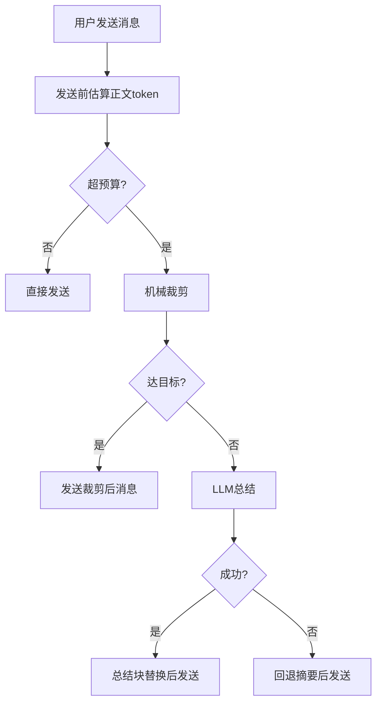

# OpenCode Memory System

一个把 **Claude-Mem 风格记忆** 和 **DCP 风格发送前裁剪/总结** 合并的 OpenCode 插件。

## 目录
- [中文说明](#中文说明)
- [English Guide](#english-guide)

---

## 中文说明

### 目录（中文）
- [1. 功能概览](#1-功能概览)
- [2. 安装教程](#2-安装教程)
- [3. 启动与使用](#3-启动与使用)
- [4. 37777 页面说明](#4-37777-页面说明)
- [5. 参数说明](#5-参数说明)
- [6. 模板机制](#6-模板机制)
- [7. 裁剪/总结/替换流程](#7-裁剪总结替换流程)
- [8. 数据文件路径](#8-数据文件路径)
- [9. 常见问题](#9-常见问题)

### 1. 功能概览
- 自动会话记忆（项目维度 + 会话维度）。
- 全局偏好记忆（`global.json`）。
- 跨会话召回（触发词或手动 recall）。
- 发送前机械裁剪（低信号工具输出降权/替换）。
- 超阈值后 LLM 总结（内联或独立）。
- 37777 看板可视化管理（参数、模板、LLM、回收站）。

### 2. 安装教程

#### 2.1 仅需两个文件
- `plugins/memory-system.js`
- `plugins/scripts/opencode_memory_dashboard.mjs`

#### 2.2 放入 OpenCode 全局配置
- macOS/Linux:
  - `~/.config/opencode/plugins/memory-system.js`
  - `~/.config/opencode/plugins/scripts/opencode_memory_dashboard.mjs`
- Windows:
  - `C:\Users\<用户名>\.config\opencode\plugins\memory-system.js`
  - `C:\Users\<用户名>\.config\opencode\plugins\scripts\opencode_memory_dashboard.mjs`

#### 2.3 opencode.json 启用
```json
{
  "plugin": [
    "./plugins/memory-system.js"
  ]
}
```

#### 2.4 重启 OpenCode
重启后自动生效，37777 会随 OpenCode 启停。

### 3. 启动与使用
- 正常聊天即可，默认自动记录记忆与发送前裁剪。
- 看板地址：`http://127.0.0.1:37777`
- 支持 OpenCode 前端与 CLI。

### 4. 37777 页面说明
菜单顺序：
1. 会话记忆
2. 模板设置
3. LLM设置
4. 参数设置
5. 回收站

#### 4.1 会话记忆页
- 查看各会话统计、注入次数、pretrim 轨迹。
- 编辑摘要、删除会话记忆、批量删除。

#### 4.2 模板设置页
- 支持占位符模板（JSON/Markdown 都可）。
- 支持模板命名、按名称保存、选择并设为当前模板。
- 支持模板预览与恢复默认。

#### 4.3 LLM 设置页
- 自动拉取模型列表。
- 验证配置（成功/失败均有明确提示）。
- 支持内联模式、独立模式、自动模式。

#### 4.4 参数设置页
- 双栏折叠布局：
  - 左：开关参数（默认展开）
  - 右：数值参数（默认折叠）
- 修改后保存即持久化。

#### 4.5 回收站页
- 支持保留天数、清理过期、永久删除。

### 5. 参数说明
核心参数：
- `sendPretrimEnabled`: 发送前裁剪开关。
- `sendPretrimBudget`: 触发预算阈值。
- `sendPretrimTarget`: 裁剪目标阈值。
- `sendPretrimTurnProtection`: 最近保护窗口轮数。
- `sendPretrimDistillTriggerRatio`: LLM总结触发比例。
- `llmSummaryMode`: `auto|session|independent`。
- `independentLlm*`: 独立LLM连接参数。

### 6. 模板机制

#### 6.1 占位变量
`{{window}} {{events}} {{status}} {{sessionCwd}} {{recommendedWorkdir}} {{relatedWorkdirs}} {{keyFacts}} {{taskGoal}} {{keyOutcomes}} {{toolsUsed}} {{skillsUsed}} {{keyFiles}} {{decisions}} {{blockers}} {{todoRisks}} {{nextActions}} {{workdirScoring}} {{handoffAnchor}}`

#### 6.2 JSON 模板示例
```json
{
  "status": "{{status}}",
  "workspace": "{{recommendedWorkdir}}",
  "key_outcomes": "{{keyOutcomes}}",
  "next_actions": "{{nextActions}}"
}
```

#### 6.3 是否所有总结都按模板
- 会话压缩摘要会按“当前激活模板”输出。
- 发送前的 LLM 总结块仍有内部保护结构（为保证替换与可追踪），但内容同样受模板字段约束。

### 7. 裁剪/总结/替换流程


### 8. 数据文件路径
- `~/.opencode/memory/global.json`
- `~/.opencode/memory/config.json`
- `~/.opencode/memory/projects/<project>/sessions/*.json`
- `~/.opencode/memory/dashboard/index.html`
- `~/.opencode/memory/trash/*`
- `~/.opencode/memory/audit/memory-audit.jsonl`

### 9. 常见问题
- Q: 页面没更新？
  - A: 强刷浏览器，或重启 OpenCode（会自动重建页面并动态拉取）。
- Q: 独立LLM超时？
  - A: 提高 `independentLlmTimeoutMs`（建议 30000ms）。
- Q: 为什么 token 还高？
  - A: 系统层/MCP 定义通常不在本插件裁剪范围。

---

## English Guide

### Contents
- [What It Does](#what-it-does)
- [Install](#install)
- [Usage](#usage)
- [Dashboard Pages](#dashboard-pages)
- [Template System](#template-system)
- [Pretrim Flow](#pretrim-flow)
- [Paths](#paths)

### What It Does
- Session/global memory
- Cross-session recall
- Send-time mechanical trim
- LLM summary on overflow
- Visual dashboard at `:37777`

### Install
1. Copy files:
- `plugins/memory-system.js`
- `plugins/scripts/opencode_memory_dashboard.mjs`
2. Put into OpenCode config dir:
- macOS/Linux: `~/.config/opencode/plugins/...`
- Windows: `C:\Users\<User>\.config\opencode\plugins\...`
3. Enable plugin in `opencode.json`:
```json
{
  "plugin": ["./plugins/memory-system.js"]
}
```
4. Restart OpenCode.

### Usage
- Works automatically in chat.
- Open dashboard: `http://127.0.0.1:37777`

### Dashboard Pages
1. Sessions
2. Templates
3. LLM Settings
4. Runtime Settings
5. Trash

### Template System
- Named templates with placeholders.
- Save by name, activate by name, preview, reset default.
- Stored in `memorySystem.summaryTemplates` + `activeSummaryTemplateName`.

### Pretrim Flow
- Budget check -> mechanical trim -> LLM summary (if needed) -> fallback if LLM fails.

### Paths
- `~/.opencode/memory/config.json`
- `~/.opencode/memory/global.json`
- `~/.opencode/memory/projects/.../sessions/*.json`
- `~/.opencode/memory/dashboard/index.html`
