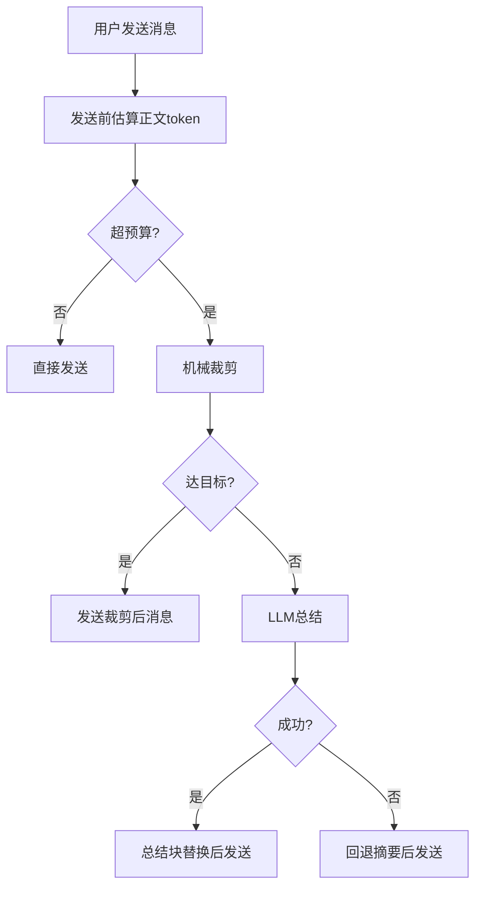

# OpenCode Memory System

一个把 **Claude-Mem 风格记忆** 和 **DCP 风格发送前裁剪/总结** 合并的 OpenCode 插件。

## 目录
- [中文说明](#中文说明)
- [English Guide](#english-guide)

---

## 中文说明

### 目录（中文）
- [1. 功能概览](#1-功能概览)
- [2. 安装教程](#2-安装教程)
- [3. 启动与使用](#3-启动与使用)
- [4. 37777 页面说明](#4-37777-页面说明)
- [5. 参数说明](#5-参数说明)
- [6. 模板机制](#6-模板机制)
- [7. 裁剪/总结/替换流程](#7-裁剪总结替换流程)
- [8. 数据文件路径](#8-数据文件路径)
- [9. 常见问题](#9-常见问题)

### 1. 功能概览
- 自动会话记忆（项目维度 + 会话维度）。
- 全局偏好记忆（`global.json`）。
- 跨会话召回（触发词或手动 recall）。
- 发送前机械裁剪（低信号工具输出降权/替换）。
- 超阈值后 LLM 总结（内联或独立）。
- 37777 看板可视化管理（参数、模板、LLM、回收站）。

### 2. 安装教程

#### 2.1 需要三个文件
- `plugins/memory-system.js`
- `plugins/scripts/opencode_memory_dashboard.mjs`
- `plugins/dashboard/template.html`

#### 2.2 放入 OpenCode 全局配置
- macOS/Linux:
  - `~/.config/opencode/plugins/memory-system.js`
  - `~/.config/opencode/plugins/scripts/opencode_memory_dashboard.mjs`
  - `~/.config/opencode/plugins/dashboard/template.html`
- Windows:
  - `C:\Users\<用户名>\.config\opencode\plugins\memory-system.js`
  - `C:\Users\<用户名>\.config\opencode\plugins\scripts\opencode_memory_dashboard.mjs`
  - `C:\Users\<用户名>\.config\opencode\plugins\dashboard\template.html`

#### 2.3 opencode.json 启用
```json
{
  "plugin": [
    "./plugins/memory-system.js"
  ]
}
```

#### 2.4 重启 OpenCode
重启后自动生效。`37777` 当前实现是 watchdog 跟随模式，通常会随 OpenCode 启动；如果本地未拉起，可手动执行 restart/start 恢复。

### 3. 启动与使用
- 正常聊天即可，默认自动记录记忆与发送前裁剪。
- 看板地址：`http://127.0.0.1:37777`
- 支持 OpenCode 前端与 CLI。
- 常见使用方式：
  1. 直接聊天：插件会自动记住当前会话摘要，并在需要时做发送前裁剪。
  2. 跨会话续接：在新会话里明确提到“另一个会话/上一个会话/刚刚那个会话”，会触发 recall 注入。
  3. 写入全局偏好：直接说“请记住我偏好中文回复”这类句子，模型可调用 memory 写入全局偏好。
  4. 调参数：去 37777 的“参数页”或“LLM设置”页保存，下一次请求立即生效。
  5. 手动命令：在 `opencode run` 或模型自动输出里，优先走 `memory` tool / 自然语言主路径，不要依赖 `"/memory ..."` slash 形式。当前 live 中，`/memory recall ...` 相对最稳定，其余 slash 子命令不保证在 `opencode run` 下按手动命令语义执行。

### 4. 37777 页面说明
菜单顺序：
1. 会话记忆
2. 摘要模板设置
3. LLM设置
4. 参数设置
5. 回收站

#### 4.1 会话记忆页
- 查看各会话统计、注入次数、pretrim 轨迹。
- 编辑摘要、删除会话记忆、批量删除。
- 支持 `全选 / 全不选 / 批量删除`。
- 展开某个会话后，可以直接看到：
  - `压缩摘要`
  - `发送前系统层审计`
  - `发送前裁剪轨迹`
  - `后台预总结日志`

#### 4.2 摘要模板设置页
- 支持占位符模板（JSON/Markdown 都可）。
- 支持模板命名、按名称保存、选择并设为当前模板。
- 支持模板预览与恢复默认。

#### 4.3 LLM 设置页
- 自动拉取模型列表。
- 验证配置（成功/失败均有明确提示）。
- 支持内联模式、独立模式、自动模式。

#### 4.4 参数设置页
- 双栏折叠布局：
  - 左：开关参数（默认展开）
  - 右：数值参数（默认折叠）
- 修改后保存即持久化。

#### 4.5 回收站页
- 支持保留天数、清理过期、永久删除。
- 说明：
  - memory 插件自己的“删除会话 -> 回收站”链路已经验收通过。
  - OpenCode 原生 “Archive” 会把时间写到上游 session 的 `time.archived/time_archived`，但当前 `GET /session` API 还不支持 `archived` 查询过滤。
  - 因此如果你直接访问 `4096` 的 `/session?archived=false`，仍可能看到已归档 session；这不是 memory 插件持久化失败。

### 5. 参数说明
核心参数：
- `sendPretrimEnabled`: 发送前裁剪开关。
- `sendPretrimBudget`: 触发预算阈值。
- `sendPretrimTarget`: 裁剪目标阈值。
- `sendPretrimTurnProtection`: 最近保护窗口轮数。
- `sendPretrimDistillTriggerRatio`: LLM总结触发比例。
- `llmSummaryMode`: `auto|session|independent`。
- `independentLlm*`: 独立LLM连接参数。
- `visibleNoticesEnabled`: 总开关，控制是否发可见提示。
- `visibleNoticeForDiscard`: 是否显示“已裁剪/已丢弃”类提示。
- `visibleNoticeCurrentSummaryMirrorEnabled`: current-summary 注入时是否启用镜像提示策略。
- `visibleNoticeCooldownMs`: 可见提示冷却，避免刷屏。
- `visibleNoticeMirrorDeleteMs`: 镜像提示自动删除延迟。

补充：
- `visibleNoticesEnabled=false` 的 fresh live 已验证：
  - 注入仍会执行
  - 但 `inject.lastNoticeChannel / lastNoticeText` 会保持为空
  - 即该开关不是“只改配置文本”，而是会真实抑制 visible notice 投递

### 6. 模板机制

#### 6.1 占位变量
`{{window}} {{events}} {{status}} {{sessionCwd}} {{recommendedWorkdir}} {{relatedWorkdirs}} {{keyFacts}} {{taskGoal}} {{keyOutcomes}} {{toolsUsed}} {{skillsUsed}} {{keyFiles}} {{decisions}} {{blockers}} {{todoRisks}} {{nextActions}} {{workdirScoring}} {{handoffAnchor}}`

#### 6.2 JSON 模板示例
```json
{
  "status": "{{status}}",
  "workspace": "{{recommendedWorkdir}}",
  "key_outcomes": "{{keyOutcomes}}",
  "next_actions": "{{nextActions}}"
}
```

#### 6.3 是否所有总结都按模板
- 会话压缩摘要会按“当前激活模板”输出。
- 发送前的 LLM 总结块仍有内部保护结构（为保证替换与可追踪），但内容同样受模板字段约束。

#### 6.4 模板保存到哪里
- 前端页面点击“按名称保存模板”后，不会在磁盘上单独生成一个 `.json` 或 `.md` 模板文件。
- 模板以字符串字典形式保存在：
  - `~/.opencode/memory/config.json`
- 相关字段：
  - `memorySystem.summaryTemplates`
  - `memorySystem.activeSummaryTemplateName`
- 模板内容格式本质上是文本模板；推荐写成 JSON 结构文本，但实际落盘仍是 `config.json` 里的字符串值。

### 7. 裁剪/总结/替换流程


### 7.1 模板外置与回退
- 仪表盘页面模板已外置到 `plugins/dashboard/template.html`。
- `memory-system.js` 渲染时优先读取该模板并注入数据。
- 若模板缺失/损坏，自动回退到内嵌 legacy 渲染，不影响功能。

### 7.2 token 统计口径
- 看板会分别显示：
  - `正文约`
  - `system约`
  - `插件附加约`
  - `总量约`
- 当前实现里：
  - `总量约 = 正文 + system`
  - `插件附加约` 单独显示，不并入 `总量约`
- 因此在某些 session 中会出现：
  - `正文约` 很小
  - `总量约` 仍然偏高
  - `插件附加约` 作为额外单列显示

### 8. 数据文件路径
- `~/.opencode/memory/global.json`
- `~/.opencode/memory/config.json`
- `~/.opencode/memory/projects/<project>/sessions/*.json`
- `~/.opencode/memory/dashboard/index.html`
- `~/.opencode/memory/trash/*`
- `~/.opencode/memory/audit/memory-audit.jsonl`

### 9. 常见问题
- Q: 我什么时候才需要用 `doctor`？
  - A: 只有在你怀疑“应该记住却没记住”“裁剪太狠”“召回没触发”“system 太大挤爆正文”时再用。平时正常聊天不用天天跑。
- Q: `doctor` 怎么用？用了之后我要怎么办？
  - A: 常用命令：
    - `/memory doctor`
    - `/memory doctor current`
    - `/memory doctor session <id>`
  - 先看它报的是哪一类问题：
    - `summary/recall 未触发`：去 37777 看参数是否开着，必要时提高摘要频率或 recall 条数。
    - `裁剪太激进`：把 `发送前裁剪预算` 调高，把 `发送前裁剪目标` 调高，或把 `近轮保护消息数` 调大。
    - `system 太高`：去 37777 看“发送前系统层审计”，确认到底是 MCP、skill 还是插件自己的 system 文本在变大。
    - `独立LLM失败`：先看 LLM 设置页是否真的配全；没配全就会退回内联或规则回退。
- Q: 37777 里怎么看“发送前完整包审计”？
  - A: 当前做的是“系统层审计”第一版，不是整包正文审计。位置在：
    - 37777 → 会话页 → 展开某个会话 → `发送前系统层审计`
  - 这里会显示最近一次真正发给模型的 system 文本，主要用于判断是 MCP、skill 还是插件在干扰。
- Q: 页面没更新？
  - A: 强刷浏览器，或重启 OpenCode（会自动重建页面并动态拉取）。
- Q: 独立LLM超时？
  - A: 默认已是 `30000ms`，可在 37777 的 `LLM设置`页继续调高。
- Q: 4097 在跑但 37777 没起来？
  - A: 可手动执行：
    - `node ~/.config/opencode/plugins/scripts/opencode_memory_dashboard.mjs restart 37777`
    - 然后访问 `http://127.0.0.1:37777`。
- Q: `/memory` 子命令为什么在 `opencode run` 下不稳定？
  - A: 当前最稳的主路径是让模型调用 `memory` tool，或直接用自然语言触发自动写入/recall。`/memory recall ...` 相对可靠，但 `stats/doctor/prune/context/compress/distill` 等 slash 形式在 `opencode run` 下不保证按手动命令语义执行。
- Q: 为什么 token 还高？
  - A: 系统层/MCP 定义通常不在本插件裁剪范围；同时 `插件附加约` 是单独统计列，不并入 `总量约`。
- Q: 为什么 Web 端看不到 `记忆提示` toast？
  - A: 当前最新取证已确认，这不是 memory 插件没发 notice，而是 OpenCode Web/Server 上游的 notice SSE/渲染链路缺口。插件侧继续硬改只会重新引入 `收到。` 或假 `user-message` 污染。
- Q: 归档后为什么 API 里还能看到 session？
  - A: OpenCode 原生归档状态确实会写入 `time_archived`，但当前 `GET /session` API 并不支持 `archived` 过滤，所以 `?archived=false`/`?archived=true` 目前不会分流。
- Q: 独立 LLM provider 现在支持哪些协议？
  - A: 当前插件协议层已覆盖并完成本地 37777 live 验证：
    - `openai_compatible`
    - `gemini`
    - `anthropic`
  - 需要注意的是，`anthropic` 若手填了错误模型名会验证失败；用 provider 实际返回的模型名即可正常通过。

### 9.1 当前验证状态（2026-03-09）
- 六类核心场景 `S1/S2/S3/S4/S5/S6` 已在 CLI 与 `opencode web` 双端拿到真实正样本。
- 已确认的主链包括：
  - 机械裁剪 / extract / distill / replace 会真实发生
  - inline 成功 / inline 失败回退
  - independent 成功 / independent 失败回退
  - token 会下降，且样本中末轮短请求未失忆
- 已完成的额外专项：
  - `37777` 跟随 `opencode web` 的关闭/恢复
  - Web `--- 2` 污染样本复测翻正
  - Web 手动 `/memory stats / doctor / context / prune / distill / compress / clear`
  - `system/body/total` 与 dashboard / doctor / context 口径对齐
  - 旧标题 recall、无匹配 recall、链式第二问 recall
- 当前剩余更偏“补证据”而不是“修主故障”：
  - Web `current-summary-refresh` 的前端可见提示样本
  - 六类场景与 dashboard/session 审计同步的更细粒度取证
  - 更弱问法（如“另一个代号”）的 recall 鲁棒性
  - README 其余安装/验证细节与现状逐条对齐

### 9.2 最新补证（2026-03-10）
- 已完成“完整前端仪表盘交互验收”（API/持久化/重启重载）：
  - 新增脚本：`scripts/dashboard_interaction_acceptance_suite.mjs`
  - 验收结果：`11/11 PASS`
  - 覆盖：settings/global/session-summary/单删批删/trash cleanup+delete/llm routes/重启重载/中英文风险文案键
- 已完成 `system token` 告警策略闭环（插件/doctor/dashboard 同口径）：
  - 新增 `systemTokenRisk` 自动判定（基于 `system/body/total`）。
  - `syncBudgetTokenSnapshot()` 在每次 token 快照更新时同步刷新/清除该告警。
  - `/memory doctor` 的 `risk` 现在包含：
    - `contextStackRisk`
    - `systemTokenRisk`
  - `run_path_regression_suite.mjs` 新增三条回归并通过：
    - `system token risk alert triggers in budget snapshot`
    - `system token risk alert clears in safe range`
    - `doctor reports system token risk`
- Web `toast-region` 已确认真实存在，但在 Playwright headless fresh live 中：
  - `inject.lastNoticeChannel = toast`
  - `toast-list` 仍为空
  - 页面 console 可见 `[global-sdk] event stream error`
- `run --attach` 负样本中的 skill boilerplate 污染已修复：
  - 历史失败样本会把 `# find-skills ...` / `find a skill for X` 写成假 `user-message`
  - 当前已扩展 skill boilerplate 过滤器，并补回归：
    - `run_path_regression_suite.mjs = 85/85 PASS`
  - fresh live 样本 `ses_328db7c49ffe9soU96NhXCa3xx` 已翻正：
    - 只保留真实 user-message
    - assistant 正确返回 `不知道`
  - 这更像 Web 实时事件流 / toast 消费层缺口，不再像插件没发 notice
- 2026-03-10 又补了一条更硬的 fresh Web 证据：
  - 当前页没有再出现 `[global-sdk] event stream error`
  - session `ses_328f1bb6cffeMu08qlQNjs4STf` 已真实触发：
    - `inject.currentSummaryCount = 1`
    - `inject.lastReason = current-session-refresh`
    - `inject.lastNoticeChannel = toast`
  - 但 `toast-region` / `toast-list` 仍为空

### 9.2.1 定向收口（2026-03-11）
- 新增收口脚本：`scripts/notice_archive_closure_suite.mjs`
- 运行结果：`2/2 PASS`
  - `notice transport consistency`：
    - 复跑 `run_path_regression_suite.mjs`
    - 关键 notice 场景（toast 主路、prompt/update 回退、notice 开关、无假 session）全部通过
    - `Result: 95/95 scenarios passed.`
  - `archive path and filter evidence`：
    - `GET /session?archived=false` 与 `GET /session?archived=true` 当前返回同口径，且都含 `time.archived` 非空会话
    - SQLite `session.time_archived` 有真实落盘（样本 `ses_32807b0abffeVsMVU7OiApkDlD`）
- 口径更新：
  - `CLI/Web notice 一致性` 已闭环
  - `会话归档路径与归档过滤行为` 已补证闭环；剩余是 OpenCode 上游 `session.list` 的 archived filter 能力缺失
  - `system/body/total` token 专项残项已补齐：
    - `doctor.risk.recommendations` 可直接给出系统 token 风险建议
    - `tokenView` 新增原生 tokenizer 探测字段（available/source/callable/note）
    - 当前环境探测为 `nativeTokenizerAvailable=false`，仍使用 `chars/4` 估算
  - 弱指代 recall / attach 复用扩样本已新增并通过：
    - `remaining-variant`、`corresponding-variant`、`attach reused weak-followup` 三条场景
    - `run_path_regression_suite` 基线更新为 `98/98 PASS`
  - Web 前端主链路新增聚合验收：
    - `scripts/web_frontend_main_chain_suite.mjs = 3/3 PASS`
    - 子项：
      - `dashboard_interaction_acceptance_suite = 12/12 PASS`
      - `run_path_regression_suite = 98/98 PASS`
      - `notice_archive_closure_suite = 2/2 PASS`
  - “手动编辑 session 摘要写回”新增显式断言：
    - `dashboard_interaction_acceptance_suite` 增加
      - `manual session summary edit survives restart`
    - 已验证“落盘 + 重启后仍一致”
  - Web 侧 `preferences.note` 防污染收尾：
    - `run_path_regression_suite` 新增
      - `web-path generic global write does not pollute preferences.note`
    - 结果：普通全局说明在 Web 事件路径也会走
      - `command=noop`
      - `reason=unsupported_global_write`
      - 且 `preferences.note` 保持不变
  - Windows/桌面壳兼容收口：
    - 新增 `scripts/windows_desktop_shell_compat_suite.mjs = 5/5 PASS`
    - 已覆盖 Windows 路径候选、统一 4096 语义、watchdog 生命周期、serve/web 命令可用性
    - 本机无 Windows/桌面 GUI 实机环境，外部机器仅需补 UI 烟测
  - `/memory` 子命令完整矩阵收口：
    - 新增 `scripts/memory_subcommand_matrix_suite.mjs = 20/20 PASS`
    - 覆盖 `global/set/prefer/stats/doctor/context/discard/extract/prune/distill/compress/recall/clear/dashboard`
    - direct + slash 混合路径均已脚本化
  - MCP/skill 误写 + notice/discard/inject 开关专项收口：
    - 新增 `scripts/mcp_skill_notice_switch_suite.mjs = 7/7 PASS`
    - MCP 定义文本（`## Namespace ... type mcp__...`）与 skill boilerplate 均不再写入 `user-message`
    - `visibleNoticesEnabled`、`visibleNoticeForDiscard`、`visibleNoticeCurrentSummaryMirrorEnabled` 均有自动化开关样本
  - protection window + provider 系统验收收口：
    - 新增 `scripts/protection_provider_acceptance_suite.mjs = 7/7 PASS`
    - 已验证：
      - 前端设置接口可保存 `sendPretrimTurnProtection`
      - `/memory doctor` 输出 `policy.turnProtection`
      - OpenAI/Anthropic/Gemini 三风格的 `models/validate` 接口均通过
  - 回归基线更新：
    - `run_path_regression_suite.mjs = 100/100 PASS`

### 9.3 验收清单逐条对齐索引（1-19）
- 本仓库 README 与用户验收清单的逐条映射表在：
  - `/Users/wsxwj/Desktop/opencode file/acceptance_alignment_20260310/CHECKLIST_README_ALIGNMENT.md`
- 该表按 1~19 验收域逐条标注：
  - 当前状态（完成/部分完成/上游）
  - README 对齐口径
  - 剩余项边界
  - 且页面内手工 `fetch('/tui/show-toast', ...) = true` 后，DOM 依然不出现 `记忆提示`
  - 因此当前已可把 Web toast 不可见问题明确排除到插件外：这是 OpenCode Web 当前前端的 toast 消费 / 渲染缺口
- Web 首条真实消息已确认只创建一个新的正确 session 文件：
  - fresh `repo` 样本中目录文件数 `44 -> 45`
  - 最新 session 文件只含 `session-start / user-message / assistant-message`
- Web `Archive` 当前已确认：
  - UI 列表里 session 会消失
  - memory 插件的 session 文件仍保留
  - OpenCode 上游 `PATCH /session/:id` 会把归档时间写入 `SessionTable.time_archived`
  - 但 `GET /session` 当前 query schema 不支持 `archived`
  - 所以 `4096 /session?archived=false` 仍可返回带 `time.archived` 的 session
  - 当前已可明确归类为 OpenCode 上游 session.list API 的过滤能力缺失
- fresh Web 弱指代 recall 已新增一轮真实修复：
  - 修复前，`DELTA-76431 -> sessionID`
  - 修复后，`DELTA-76441 -> ORCA-76441`
  - 根因是 recall 注入文本把 `sessionID` 放在过高显著位；当前实现已默认隐藏该字段，避免模型把它当答案抄回
- 2026-03-10 又补了一轮 fresh Web isolated-session recall：
  - `我知道 DELTA-95431，另一个呢？ -> ORCA-95431`
  - `DELTA-95431 的另一个呢？ -> ORCA-95431`
  - `我已经知道 DELTA-95431，那另一个代号是什么？ -> ORCA-95431`
  - 真正负样本 `DELTA-99995 -> 不知道`
  - 这些 session 的 `recentEvents` 都保持干净，说明 Web recall 主链目前已不仅是“能答一次”，而是对多种弱指代问法都有 fresh live 证据
- `run --attach` 负样本中的 skill boilerplate 污染已修复：
  - 历史污染样本 `ses_329228ac2ffe5Gw7ZVOZYHU17Z` 曾把
    - `Loading skill: brainstorming`
    - `You MUST use this before any creative work ...`
    误写进 `recentEvents`
  - 当前实现新增 `isSkillBoilerplateUserText(...)` 并接入 user-event 过滤主链
  - fresh live `ses_3291d3b55ffeIqyccBQw18sK95` 已翻正为
    - `session-start`
    - 一条真实 `user-message`
    - 一条 `assistant-message = 不知道`
  - 不再出现 skill boilerplate user-event 污染

### 10. 联调检查（4097 + 37777）
1. 启动 OpenCode：
   - `opencode web --port 4097`
2. 检查两端口：
   - `curl -I http://127.0.0.1:4097`
   - `curl -I http://127.0.0.1:37777`
3. 检查面板API：
   - `curl http://127.0.0.1:37777/api/dashboard`

---

## English Guide

### Contents
- [What It Does](#what-it-does)
- [Install](#install)
- [Usage](#usage)
- [Dashboard Pages](#dashboard-pages)
- [Template System](#template-system)
- [Pretrim Flow](#pretrim-flow)
- [Paths](#paths)

### What It Does
- Session/global memory
- Cross-session recall
- Send-time mechanical trim
- LLM summary on overflow
- Visual dashboard at `:37777`

### Install
1. Copy files:
- `plugins/memory-system.js`
- `plugins/scripts/opencode_memory_dashboard.mjs`
- `plugins/dashboard/template.html`
2. Put into OpenCode config dir:
- macOS/Linux: `~/.config/opencode/plugins/...`
- Windows: `C:\Users\<User>\.config\opencode\plugins\...`
3. Enable plugin in `opencode.json`:
```json
{
  "plugin": ["./plugins/memory-system.js"]
}
```
4. Restart OpenCode.
   Dashboard `:37777` normally follows OpenCode via a watchdog-style lifecycle. If it is missing, restart/start the dashboard script manually.

### Usage
- Works automatically in chat.
- Open dashboard: `http://127.0.0.1:37777`
- Typical workflow:
  1. Chat normally; the plugin records session memory and applies send-time trim when needed.
  2. Mention a previous session explicitly to trigger cross-session recall.
  3. Save preferences or adjust LLM/runtime settings in the dashboard; changes apply to the next request.
  4. In `opencode run` or model-generated output, prefer the `memory` tool / natural-language path instead of relying on `"/memory ..."` slash commands. `"/memory recall ..."` is the most reliable manual slash form right now.

### Dashboard Pages
1. Sessions
2. Templates
3. LLM Settings
4. Runtime Settings
5. Trash

### Template System
- Named templates with placeholders.
- Save by name, activate by name, preview, reset default.
- Stored in `memorySystem.summaryTemplates` + `activeSummaryTemplateName`.
- Templates are not written as separate files; they are persisted inside `~/.opencode/memory/config.json`.

### Pretrim Flow
- Budget check -> mechanical trim -> LLM summary (if needed) -> fallback if LLM fails.
- Dashboard token display uses separate columns for body, system, plugin-hint, and total. Current total excludes plugin-hint.
- Web visible notices now prefer native `tui.showToast()`; only when toast is unavailable does the plugin fall back to `session.prompt(noReply)` and then `session.update`.
- Visible notice cooldown is scoped by `sessionID + key`, so `global-prefs` and `current-session-refresh` no longer suppress each other.
- `current-summary` frequency now counts persisted `stats.userMessages`, so replaced/filtered transient user events no longer trigger summary refresh one turn early.

### Current Validation State
- Pollution-chain tracking is now systematized:
  - matrix doc: `/Users/wsxwj/Desktop/opencode file/pollution_chain_matrix_20260310/POLLUTION_CHAIN_MATRIX.md`
  - status model: `Closed / Monitoring / Upstream`
- Acceptance checklist alignment is now explicit:
  - alignment project: `/Users/wsxwj/Desktop/opencode file/acceptance_alignment_20260310/`
  - no-fake-session control is regression-covered:
    - `visible notice (toast path) does not create extra session files`
    - `visible notice (prompt fallback) does not create extra session files`
  - latest regression baseline: `run_path_regression_suite.mjs = 92/92 PASS`
- CLI and Web have positive live samples for the 6 core scenarios `S1..S6`.
- Cross-session recall core path is live-verified, including title hit, no-match, and chained follow-up.
- Fresh `run --attach` live no longer reproduces the old quoted/truncated duplicate user-event issue.
- Fresh Web current-summary frequency is live-verified on `ses_32a961521ffe7jorMmmcG6lreI`:
  - `stats.userMessages = 5`
  - `inject.currentSummaryCount = 1`
  - `inject.lastNoticeChannel = toast`
- Fresh Web DOM structure is also live-verified as normal readable DOM, not a canvas-only shell:
  - `canvasCount = 0`
  - `iframeCount = 0`
  - `shadowHosts = []`
- Fresh Web toast-region inspection shows the notification container exists, but it remains empty in the current Playwright headless session:
  - `data-component="toast-region"`
  - `data-slot="toast-list"`
  - `/tui/show-toast` can return `true` while the list still stays empty
  - the same page reports `[global-sdk] event stream error ... TypeError: network error`
- A fresh plugin-side fallback trial also ruled out `session.prompt(noReply)` as a Web-visible substitute:
  - test session: `ses_32949404dffehaL5qEUMNFzbqQ`
  - real user/assistant turns remained visible
  - but the page still showed no `记忆提示`
  - so the remaining gap is not solved by changing plugin transport order
- Fresh Web first-message session creation is also live-verified:
  - session files increased `43 -> 44`
  - exactly one new session file was created: `ses_3296f9bcdffe5LhTikCcDXuDYA`
  - the initial persisted state was only `session-start + 1 user-message`
- Fresh Web archive validation shows current archive behavior is UI/session-layer hiding, not memory-file relocation:
  - the archived session disappears from the visible Web list
  - the memory plugin session file still remains under `~/.opencode/memory/projects/repo/sessions/`
- Fresh CLI visible notice is live-verified on `ses_32a919dabffedvw4TSHOoESvLq`:
  - TUI visibly renders `记忆提示：已注入全局偏好记忆（~68 tokens）`
  - `inject.lastNoticeChannel = toast`
- Weak follow-up recall also has fresh new-session CLI evidence for both:
  - exact phrasing: `DELTA-56321 -> ORCA-56321`
  - shorter phrasing: `我知道 DELTA-67421，另一个呢？ -> ORCA-67421`
- Fresh new-session Web evidence also exists for:
  - positive follow-up: `DELTA-85327 -> ORCA-85327`
  - negative follow-up: `DELTA-99993 -> 不知道`
- Remaining acceptance gap is now concentrated in Web render and final wording alignment:
  - fresh Web `current-summary-refresh` inject audit is now clean in-session, but the toast still does not appear in the current Web page DOM even though the page itself is normal readable DOM and the toast region exists
  - `session.prompt(noReply)` was also tested as a primary visible-notice path and still did not surface `记忆提示` in the current Web DOM
  - in Playwright headless validation, this gap is now strongly correlated with `[global-sdk] event stream error`, so the remaining issue appears closer to the Web realtime event stream than to the plugin itself
  - the old Web `late duplicate user-message.updated -> 收到。` variant no longer reproduced in the latest fresh live after switching notice delivery to toast-first
  - compatibility core suites are now closed by script evidence (`notice/archive`, `provider`, `switches`, `memory subcommands`, `queue/article-writing/review-writing/sci2doc`)
  - remaining compatibility tail is external-machine proof only (Windows/desktop GUI shell smoke)

### Remaining Items (Checklist-Linked)

1. Web toast/current-summary DOM visibility (upstream OpenCode Web/Server gap; plugin-side closure completed).
2. Windows/desktop GUI real-machine smoke evidence (external environment).
3. Optional expansion:
   - larger long-run sample volume for attach/Web weak-followup prompts (main path already stable and covered by regression).

### Paths
- `~/.opencode/memory/config.json`
- `~/.opencode/memory/global.json`
- `~/.opencode/memory/projects/.../sessions/*.json`
- `~/.opencode/memory/dashboard/index.html`
